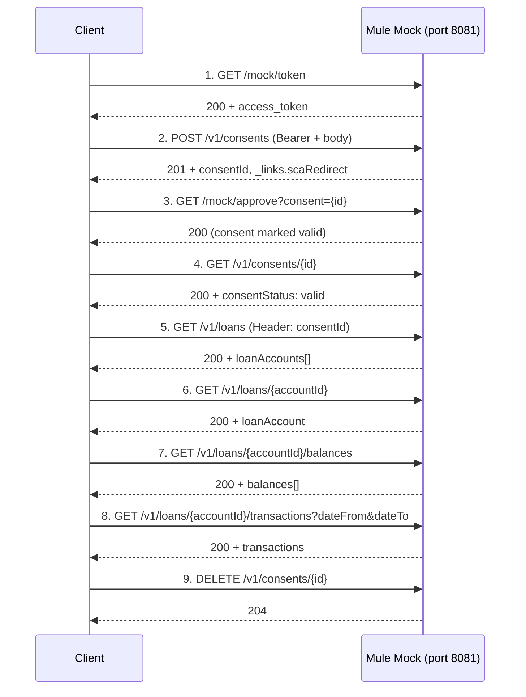

# MuleSoft Open Banking PSD2 CarLeasing –  Mock & E2E Flow 

CarLeasing acts as an ASPSP (Account Servicing Payment Service Provider). 
This repo contains a 
1. **MuleSoft mock API** (PSD2 Consent + Loan APIs)
2. **RAML API specs**
3. **e2e test scripts** (bash, Python)
4. **Postman collection** that run the full flow against the mock.<br><br>

**PSD2 APIs are based on the berlin group nextgenpsd2 spec**  
https://gitlab.com/the-berlin-group/nextgenpsd2 

**PSD2 Account Information Service (AIS) consents**  
https://gitlab.com/the-berlin-group/nextgenpsd2/-/blob/main/Core%20PSD2%20Compliancy/psd2-api_v1.3.16-2025-11-27.openapi.yaml

**PSD2 Savings and Loans API v1.1.0**  
https://gitlab.com/the-berlin-group/nextgenpsd2/-/blob/main/Extended%20Value-added%20Service/archive/psd2-api-savings-and-loans%20v1.1.0-2022-05-05v1.openapi.yaml
 <br><br>

## High-level flow

1. **Get token** (mock) →
2. **Create consent** (PSD2 AIS) →
3. **Simulate PSU approval** (mock) →
4. **Get consent** (verify valid) →
5. **Get loan list** →
6. **Get loan details** →
7. **Get loan balances** →
8. **Get loan transactions** →
9. **Delete consent** (optional).



## How to run

### 1. Start the Mule mock API

From the repo root:

**Option A - import to Anypoint Studio and start** 

**Option B - build and deploy via control plane** 
```bash
cd Mule_PSD2_Loan_ConsentMockAPI
mvn clean package
```

The API listens on **http://localhost:8081**. Leave this terminal running.

### 2. Run the E2E flow (script or Postman)

**Option A – Bash script**

```bash
./scripts/run-e2e-loan-flow.sh
```

**Option B – Python script**

```bash
python scripts/run-e2e-loan-flow.py
# or
./scripts/run-e2e-loan-flow.py
```

**Option C – Postman**

1. Import **postman/CarLeasing_PSD2_ASPSP_Test_Collection.json**.
2. Set **baseUrl** to `http://localhost:8081` (default).
3. Run requests in order **1 → 9** (request names include the step number).

Custom base URL: `BASE_URL=http://localhost:8081 ./scripts/run-e2e-loan-flow.sh`

## Example output (Python e2e run)

When the mock is running and you execute the Python (or bash) e2e script, you get output like this:

```text
=== CarLeasing PSD2 E2E Loan Flow ===
Base URL: http://localhost:8081

----------------------------------------------------------------------------------------------------
1. Get mock token
----------------------------------------------------------------------------------------------------
  Request:  GET http://localhost:8081/mock/token
  Response: HTTP 200
  Body:
    {
      "access_token": "mock-token-carleasing",
      "token_type": "Bearer"
    }
  Summary:  Token obtained (access_token present, length 21 chars)

----------------------------------------------------------------------------------------------------
2. Create consent
----------------------------------------------------------------------------------------------------
  Request:  POST http://localhost:8081/v1/consents
  Headers:  Authorization: Bearer ***, Content-Type: application/json, X-Request-ID: <uuid>
  Body:     access.allAccounts/allPsd2, validUntil: 2026-12-31
  Response: HTTP 201
  Body:
    {
      "consentId": "consent-test-001",
      "consentStatus": "received",
      "_links": {
        "scaRedirect": {
          "href": "http://localhost:8081/mock/approve?consent=consent-test-001"
        },
        "self": {
          "href": "/v1/consents/consent-test-001"
        },
        "status": {
          "href": "/v1/consents/consent-test-001/status"
        }
      }
    }
  Summary:  Consent created. CONSENT_ID=consent-test-001

----------------------------------------------------------------------------------------------------
3. Simulate PSU approval
----------------------------------------------------------------------------------------------------
  Request:  GET http://localhost:8081/mock/approve?consent=consent-test-001
  Response: HTTP 200
  Body:
    {
      "message": "Consent approved. Use GET /v1/loans with this consentId."
    }
  Summary:  Consent approved (status stored for consentId=consent-test-001)

----------------------------------------------------------------------------------------------------
4. Get consent
----------------------------------------------------------------------------------------------------
  Request:  GET http://localhost:8081/v1/consents/consent-test-001
  Headers:  Authorization: Bearer ***, X-Request-ID: <uuid>
  Response: HTTP 200
  Body:
    {
      "consentStatus": "valid",
      "consentId": "consent-test-001",
      "access": {
        "availableAccounts": "allAccounts",
        "allPsd2": "allAccounts"
      },
      "recurringIndicator": false,
      "validUntil": "2026-12-31",
      "frequencyPerDay": 4
    }
  Summary:  consentStatus=valid, consentId in path=consent-test-001

----------------------------------------------------------------------------------------------------
5. Get loan list
----------------------------------------------------------------------------------------------------
  Request:  GET http://localhost:8081/v1/loans
  Headers:  Authorization: Bearer ***, consentId: consent-test-001, X-Request-ID: <uuid>
  Response: HTTP 200
  Body:
    {
      "loanAccounts": [
        {
          "resourceId": "3dc3d5b3-7023-4848-9853-f5400a64e81a",
          "iban": "DE2310010010123456788",
          "currency": "EUR",
          "ownerName": "Max Mustermann",
          "name": "VW Group ID.4 Finance",
          "product": "Car loan",
          ...
        },
        {
          "resourceId": "3dc3d5b3-7023-4848-9853-f5400a64e816",
          "name": "VW Group Golf Finance",
          ...
        }
      ]
    }
  Summary:  Loan list OK; first loan resourceId=3dc3d5b3-7023-4848-9853-f5400a64e81a

----------------------------------------------------------------------------------------------------
6. Get loan details
----------------------------------------------------------------------------------------------------
  Request:  GET http://localhost:8081/v1/loans/3dc3d5b3-7023-4848-9853-f5400a64e81a
  ...
  Summary:  Loan details OK for resourceId=3dc3d5b3-7023-4848-9853-f5400a64e81a

----------------------------------------------------------------------------------------------------
7. Get loan balances
----------------------------------------------------------------------------------------------------
  Request:  GET http://localhost:8081/v1/loans/3dc3d5b3-7023-4848-9853-f5400a64e81a/balances
  ...
  Summary:  Loan balances OK

----------------------------------------------------------------------------------------------------
8. Get loan transactions
----------------------------------------------------------------------------------------------------
  Request:  GET http://localhost:8081/v1/loans/3dc3d5b3-7023-4848-9853-f5400a64e81a/transactions?dateFrom=2020-01-01&dateTo=2025-12-31
  ...
  Summary:  Loan transactions OK

----------------------------------------------------------------------------------------------------
9. Delete consent
----------------------------------------------------------------------------------------------------
  Request:  DELETE http://localhost:8081/v1/consents/consent-test-001
  Headers:  Authorization: Bearer ***
  Response: HTTP 204
  Summary:  Consent deleted successfully

=== E2E loan flow completed successfully ===
```

## Repo layout

| Path | Description |
|------|-------------|
| **Mule_PSD2_Loan_ConsentMockAPI/** | Mule 4 mock app (Consent AIS + Loans). Run with `mvn mule:run`. |
| **api-spec/** | RAML 1.0 specs: PSD2 Loan, PSD2 Consent, Non-PSD2 mock. |
| **postman/** | Postman collection and README. |
| **scripts/** | `run-e2e-loan-flow.sh`, `run-e2e-loan-flow.py`, README. |
| **CarLeasing Specific requirement.md** | Business/requirements summary. |

## Prerequisites

- **Mule mock:** Java 17, Maven 3.6+, Mule 4.10.x (see `Mule_PSD2_Loan_ConsentMockAPI/pom.xml`).
- **Bash script:** `curl`, `uuidgen` (macOS/Linux).
- **Python script:** Python 3.6+ (standard library only).

For more detail, see the README in **Mule_PSD2_Loan_ConsentMockAPI**, **scripts**, and **postman**.
